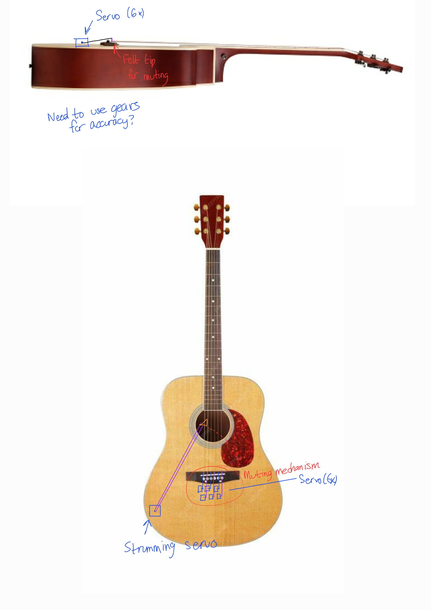

# Lord of the Strings

#### Overview
The Lord of the Strings is more than just a simple guitar strummer. This robot implements palm muting, a technique for a more advanced guitarist. Our initial ambition was to program the board to control the speed and strumming style. To this point, the buttons control style and the muting mechanism. We implemented timing mechanisms like TPM to control the movement of the servo as well as the PIT timer to control scheduling for strumming and muting patterns.

#### Video
<iframe width="560" height="315" src="https://www.youtube.com/embed/VIDEO_ID" frameborder="0" allowfullscreen></iframe>

#### System Diagram

#### Technical Approach
**Mechanical Approach**\
We will use two clamps to mount a PLA-printed plate onto the upper neck of the guitar. This plate will hold two servos: one for strumming and one for muting. The strumming servo will have a PLA-printed arm with a mounted pick to perform the strumming motion. The muting servo will have a PLA-printed arm with felt attached to the end to mute the strings. Both arms will extend over all six strings to provide strumming and muting capabilities. The plate, servo mounts, and arms will be CAD-designed by the team, while the clamps will be purchased.

**Electrical Approach**\
The electric components of the system include a 5V power supply, two SG90 hobby servos, buttons, and the FRDM board. A switch will be connected from the output of the power supply to the rest of the circuit. The FRDM board will output PWM signals to the two servos sequentially, connected from a GPIO output pin on the FRDM to the signal input on the servo. 

**Software Approach**\
We use PWM signaling for servo control similar to the PWM signals we sent to the LEDs in lab 2. However, this time we use TPM (Timer PWM Module) to have the PWM signals continously sent without using the CPU. Different rhythms can be programmed using a time division of quarter, eighth, and sixteenth notes along with muting. The onboard buttons can be used to toggle between different programmed styles and palm mute.

#### Testing and Debugging
**Mechanical Aspect**\
One of the main challenges we faced in this project was refining the design of the strumming arm. It took several iterations to resolve issues related to mechanical noise, instability, and ensuring the arm had the proper range of motion without interfering with the muting components. We also encountered clearance issues with the pick, as it initially couldn't reach the strings—this required careful adjustments to address positioning and reach. Assembling the servo mounts onto the main mounting plate was also a challenge; it took a while to finalize optimal locations for functionality and support. 
I wish we had more accurately measured where the servo mounts needed to go beforehand, as the mounting plate took a long time to print—making redesigns and reprints time-consuming.  Also, the guitar neck is not exactly flat, but rounded.  This was highlighted when our muting mechanism only really muted the top three strings and less on the bottom strings because they are positioned vertically lower due to the guitar’s design. Additionally, we had to CAD a custom servo mount to ensure the servo stood upright rather than laterally for proper strumming motion. One thing I really wish we had known before starting was the bioacoustic effect of the servo and pick—the vibrations produced a surprisingly loud mechanical noise. Unlike strumming by hand, where your fingers absorb a lot of that vibration and you mainly hear the strings, the strumming arm amplified both the string and mechanical sounds. Understanding that earlier would have informed our material and design choices for quieter operation. These experiences highlighted the importance of planning for mechanical tolerances, acoustic behavior, and clearance early in the design process.

**Electrical/Software Aspect**\
The most time-consuming aspect was implementing PWM in C. We were dealing with issues early on with getting the correct clock period and PWM cycle of 50Hz. We ended up going into the MCUXpresso clock settings and changing the core clock to 48MHz from the original 20.97MHz. This allowed us to set the correct calulations for servo motion using the TPM (Timer PWM Module). We then tweaked the values of the TPM period in order to achieve near-perfect 50Hz frequency for PWM. The oscilloscope was connected to the PWM signal to help us debug the issue of the clock and TPM period.

#### Team Work 
We organized tasks into mechanical design, electrical setup, and coding. Andrew primarily worked on coding and debuggin the FRDM board to control the servo PWM pulses and button control. Adin worked on the mechanical design for the string muting system and helped with code debugging and servo signal pulsing. Nathan designed the servo-controlled strumming arm, servo mount, and mounting plate that clamps onto the guitar. He also coded the strumming patterns and cleaned up the code.

#### Outside Resources 
We took some inspiration in mounting the plate to the guitar as well as for the strumming motion from this resource we found online: https://www.instructables.com/AutoStrummer/
In addition, we used ChatGPT and GitHub Copilot to help write and debug some of the code. It was able to give a good high-level implementation but lacked understanding of certain modules like the TPM and clock constraints. Thus, we still put in significant effort to debug and get the servos working. 