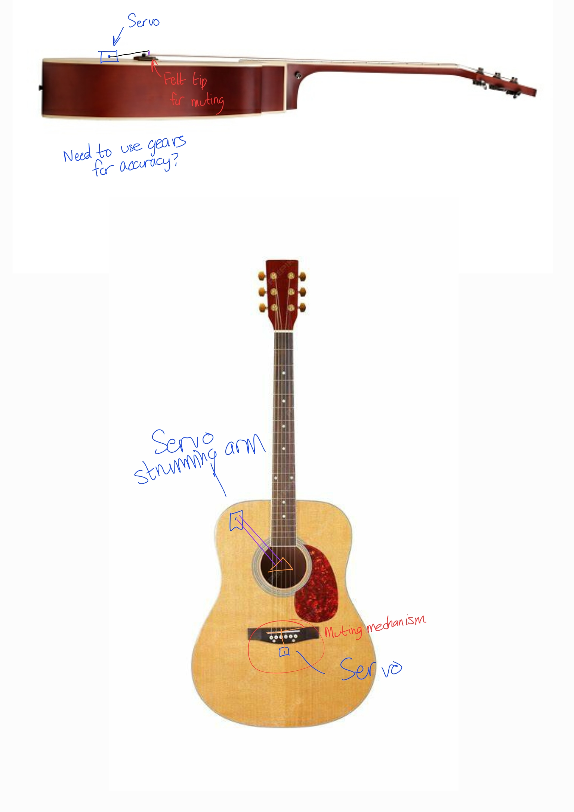

# Lord of the Strings

You can modify this page to create your final project page. Right now, the page is generated from a Markdown file (index.md) in the `page` branch. You can edit it directly from the git web interface or push it to the branch. There are a few [standard themes](https://pages.github.com/themes/) github provides. This one is `minimal`. If you'd like to change it, you can edit the `_config.yml` file.

The Markdown interface is easy, but if you would like to do something different you can add an index.html file to the branch (and any supporitng style sheets etc.) and it will be served as the webpage instead. 

# Expected page structure 

We would like your final project page to have the following structure:
- A very catchy title
- An overview section about the project
- A system diagrm that shows the major hw/sw components and how they interact 
- A short video (3-4 min) that covers:
  - Who you are
  - Project title and idea
  - Technical approach
  - A demo of the working product
  - Any technical difficulties you faced or your testing/debugging approach. Think of what YOU would have liked to know BEFORE you started this project.
  - _Please keep to the 3-4min lenght since we will ask students to watch a bunch of these. If you want a longer video that goes into more detail you can add anohter one in the technical section_. 
- Technical approach (This should be more detailed than the information in the video)
- Testing / debugging aproach
- Team work (if applicable)
- Outside resrouces

#### Overview
The Lord of the Strings is more than just a simple guitar strummer. This robot attempts to implement palm muting, a technique for a more advanced guitarist. We wish to program the board to control the speed and strumming style. Much of the software will involve testing and debugging the sensor-to-arm control scheme and fine-tuning the movement of the strumming arm. We plan to add on a felt muting bar near the bridge to imitate the guitar palm muting technique.
YouTube Video to be embedded later. 

#### Technical Approach
**Mechanical Approach**\
We will use two clamps to mount a PLA-printed plate onto the upper neck of the guitar. This plate will hold two servos: one for strumming and one for muting. The strumming servo will have a PLA-printed arm with a mounted pick to perform the strumming motion. The muting servo will have a PLA-printed arm with felt attached to the end to mute the strings. Both arms will extend over all six strings to provide strumming and muting capabilities. The plate, servo mounts, and arms will be CAD-designed by the team, while the clamps will be purchased.

**Electrical Approach**\
The electric components of the system include a 6v power supply, a switch, a buck converter, a capacitor, an SG90 servo, and the FRDM board. We will supply the system with 4x 1.5V AA batteries for a combined 6v. A switch will be connected from the output of the power supply to the rest of the circuit. We will then use a buck converter to step down the voltage from 6v to 5v. We will power the FRDM board directly from the 5v output and supply the servo power from the same 5v output through a decoupling capacitor. The FRDM board will output PWM signals to the servo, connected from a GPIO output pin on the FRDM to the signal input on the servo. 

**Software Approach**\
We will create PWM signaling for servo control similar to the PWM signals we sent to the LEDs in lab 2. We will also implement concurrency by having one servo controlling the strumming arm while the other controls the muting mechanism simultaneously. Timer-based scheduling will be used to run the servos in precise, overlapping coordination. The onboard button will be used to toggle between different programmed styles.

#### Testing and Debugging
Talk about your testing approach or subtle bugs you made/found.
#### Team Work 
How did you coordinate? Who was responsible for what? You can skip this section if you work alone. 
#### Outside Resources 
If you are using a code base from outside of class, or found a particular resource helpful, please put it here. Describe any use of generative AI tools here as well.
